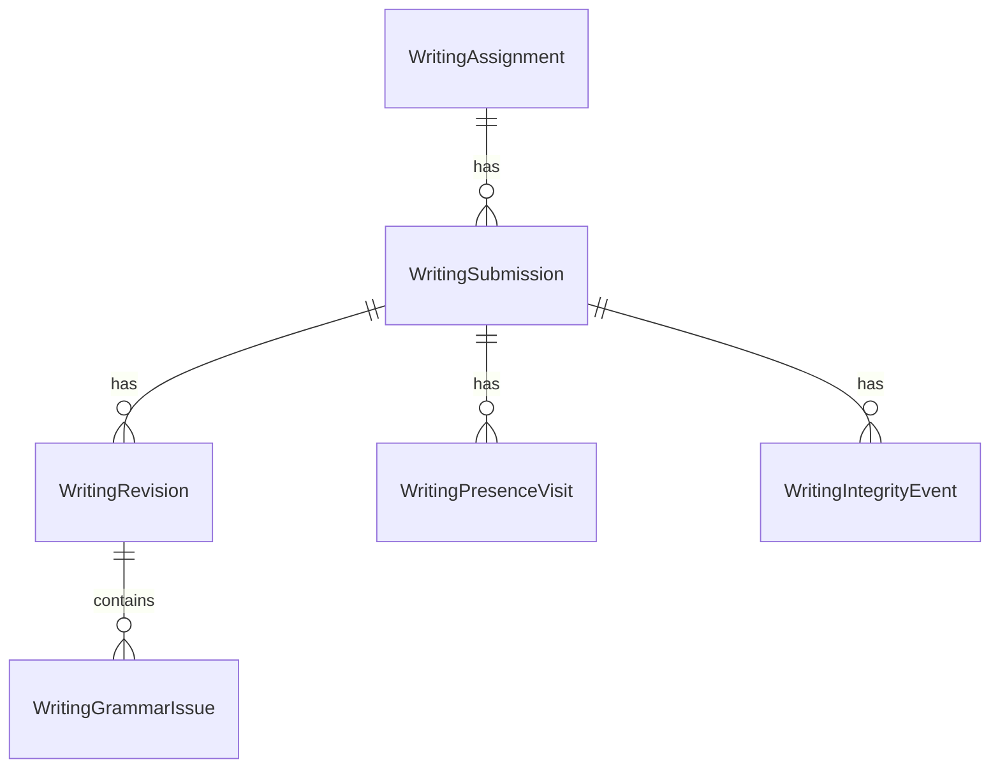

# 数据模型

本文是数据模型和状态机的唯一来源。

## 1. 现有实体摘要

现有系统核心实体包括：

| Entity | 作用 |
| --- | --- |
| `User` | 学生、教师、管理员 |
| `EmailCode` | 邮箱验证码 |
| `ClassRoom` | 教师创建的班级 |
| `ClassMember` | 班级学生关系 |
| `TopicBank` | 题库 |
| `Topic` | 口语题目 |
| `TrainingTask` | 口语训练任务 |
| `TrainingSession` | 学生训练进度和状态机 |
| `TopicDrawRecord` | 抽题记录 |
| `TrainingNote` | 口语草稿 |
| `Recording` | 录音文件 |
| `Evaluation` | 教师五维评价 |

现有数据模型保持不变。

## 2. 新增实体关系图



## 3. WritingAssignment

Table:
`writing_assignments`

| Field | Type | Nullable | Default | Constraint/Index | Why |
| --- | --- | --- | --- | --- | --- |
| `id` | Integer | No | auto | PK | 主键 |
| `teacher_id` | FK User.id | No | - | FK, index | 作业归属 |
| `class_id` | FK ClassRoom.id | No | - | FK, index | 目标班级 |
| `title` | String(200) | No | - | - | 作业标题 |
| `instructions` | Text | No | `""` | - | 写作要求 |
| `status` | Enum | No | `draft` | index | 作业状态 |
| `starts_at` | DateTime(timezone) | No | - | - | 开始时间 |
| `due_at` | DateTime(timezone) | No | - | - | 截止时间 |
| `min_words` | Integer | No | 0 | Check `>=0` | 最少字数 |
| `max_words` | Integer | Yes | null | Check `>0` | 最多字数 |
| `grammar_hint_mode` | Enum | No | `off` | - | 语法检测策略 |
| `revision_limit` | Integer | No | 1 | Check `>=0` | 首提后修改次数 |
| `allow_late_submission` | Boolean | No | false | - | 截止后是否可提交 |
| `created_at` | DateTime(timezone) | No | `utc_now` | - | 创建时间 |
| `updated_at` | DateTime(timezone) | No | `utc_now` | - | 更新时间 |

Enums:

- `WritingAssignmentStatus`: `draft`, `published`, `closed`
- `WritingGrammarHintMode`: `off`, `after_submit`

State machine:

```text
draft -> published
published -> closed
closed -> published (teacher can reopen if implemented; otherwise not allowed)
```

本次 MVP 不自动把截止时间变成 `closed`；关闭由教师显式操作或前端展示截止状态。后端提交时始终校验 `due_at` 和 `status`。

## 4. WritingSubmission

Table:
`writing_submissions`

| Field | Type | Nullable | Default | Constraint/Index | Why |
| --- | --- | --- | --- | --- | --- |
| `id` | Integer | No | auto | PK | 主键 |
| `assignment_id` | FK WritingAssignment.id | No | - | FK, index | 所属作业 |
| `student_id` | FK User.id | No | - | FK, index | 所属学生 |
| `status` | Enum | No | `drafting` | index | 提交状态 |
| `draft_content` | Text | No | `""` | - | 当前草稿 |
| `draft_word_count` | Integer | No | 0 | - | 当前草稿字数 |
| `draft_updated_at` | DateTime(timezone) | No | `utc_now` | - | 草稿最后保存时间 |
| `first_submitted_at` | DateTime(timezone) | Yes | null | - | 首次提交时间 |
| `final_submitted_at` | DateTime(timezone) | Yes | null | - | 最终提交时间 |
| `latest_revision_id` | FK WritingRevision.id | Yes | null | FK | 最新版本 |
| `created_at` | DateTime(timezone) | No | `utc_now` | - | 创建时间 |
| `updated_at` | DateTime(timezone) | No | `utc_now` | - | 更新时间 |

Constraints:

- Unique `(assignment_id, student_id)`
- Index `(assignment_id, status)`

Enums:

- `WritingSubmissionStatus`: `drafting`, `revising`, `finalized`

State machine:

```text
drafting
  -> first submit
     -> revising if assignment.revision_limit > 0
     -> finalized if assignment.revision_limit == 0

revising
  -> next submit
     -> revising if submitted_revision_count <= assignment.revision_limit
     -> finalized if submitted_revision_count > assignment.revision_limit

finalized
  -> no further edits or submissions
```

## 5. WritingRevision

Table:
`writing_revisions`

| Field | Type | Nullable | Default | Constraint/Index | Why |
| --- | --- | --- | --- | --- | --- |
| `id` | Integer | No | auto | PK | 主键 |
| `submission_id` | FK WritingSubmission.id | No | - | FK, index | 所属提交 |
| `revision_number` | Integer | No | - | - | 版本序号 |
| `client_submit_id` | String(64) | No | - | Unique with submission_id | 前端提交幂等键 |
| `content` | Text | No | - | - | 提交快照 |
| `word_count` | Integer | No | - | - | 提交字数 |
| `grammar_status` | Enum | No | `pending` | index | 检测状态 |
| `grammar_issue_count` | Integer | No | 0 | - | 问题数量 |
| `submitted_at` | DateTime(timezone) | No | `utc_now` | index | 提交时间 |
| `created_at` | DateTime(timezone) | No | `utc_now` | - | 创建时间 |
| `updated_at` | DateTime(timezone) | No | `utc_now` | - | 更新时间 |

Constraints:

- Unique `(submission_id, revision_number)`
- Unique `(submission_id, client_submit_id)`
- Check `revision_number >= 0`

Enums:

- `WritingGrammarStatus`: `not_applicable`, `pending`, `completed`, `failed`

State machine:

```text
not_applicable (grammar_hint_mode=off)
pending -> completed
pending -> failed
failed -> completed (retry-grammar)
```

## 6. WritingGrammarIssue

Table:
`writing_grammar_issues`

| Field | Type | Nullable | Default | Constraint/Index | Why |
| --- | --- | --- | --- | --- | --- |
| `id` | Integer | No | auto | PK | 主键 |
| `revision_id` | FK WritingRevision.id | No | - | FK, index | 所属版本 |
| `start_offset` | Integer | No | - | Check `>=0` | 全局字符起始 |
| `end_offset` | Integer | No | - | Check `> start_offset` | 全局字符结束 |
| `segment_id` | String(64) | Yes | null | - | 便于调试 |
| `category` | String(64) | No | `grammar` | - | 固定类别 |
| `message` | String(255) | No | - | - | 后端固定提示，不含改法 |
| `created_at` | DateTime(timezone) | No | `utc_now` | - | 创建时间 |

Index:

- `(revision_id, start_offset)`

类别：

- `grammar`
- `subject_verb_agreement`
- `tense`
- `article`
- `preposition`
- `word_order`
- `punctuation`
- `sentence_structure`

## 7. WritingPresenceVisit

Table:
`writing_presence_visits`

| Field | Type | Nullable | Default | Constraint/Index | Why |
| --- | --- | --- | --- | --- | --- |
| `id` | Integer | No | auto | PK | 主键 |
| `submission_id` | FK WritingSubmission.id | No | - | FK, index | 所属提交 |
| `student_id` | FK User.id | No | - | FK, index | 冗余归属，便于查询 |
| `client_visit_id` | String(64) | No | - | index | 前端停留标识 |
| `started_at` | DateTime(timezone) | No | `utc_now` | index | 进入时间 |
| `ended_at` | DateTime(timezone) | Yes | null | - | 离开时间 |
| `last_heartbeat_at` | DateTime(timezone) | No | `utc_now` | index | 最后心跳 |
| `end_reason` | String(32) | Yes | null | - | 离开原因 |
| `created_at` | DateTime(timezone) | No | `utc_now` | - | 创建时间 |
| `updated_at` | DateTime(timezone) | No | `utc_now` | - | 更新时间 |

Index:

- `(submission_id, started_at)`

Constraints:

- Unique `(submission_id, client_visit_id)`

`end_reason` values:

- `leave`
- `visibility_hidden`
- `pagehide`
- `idle_timeout`
- `new_visit`

## 8. WritingIntegrityEvent

Table:
`writing_integrity_events`

| Field | Type | Nullable | Default | Constraint/Index | Why |
| --- | --- | --- | --- | --- | --- |
| `id` | Integer | No | auto | PK | 主键 |
| `submission_id` | FK WritingSubmission.id | No | - | FK, index | 所属提交 |
| `student_id` | FK User.id | No | - | FK, index | 所属学生 |
| `event_type` | String(32) | No | - | - | 违规类型 |
| `source` | String(32) | No | - | - | 触发来源 |
| `detail` | String(255) | Yes | null | - | 补充信息 |
| `occurred_at` | DateTime(timezone) | No | `utc_now` | index | 发生时间 |

`event_type` values:

- `paste_blocked`
- `copy_blocked`
- `cut_blocked`
- `contextmenu_blocked`
- `drop_blocked`

## 9. Migration

新增一个 Alembic migration 文件，例如：

```text
backend/alembic/versions/xxxx_add_writing_module.py
```

Migration 必须：

- 创建以上 6 张表。
- 添加外键、唯一约束和索引。
- `upgrade` 成功创建。
- `downgrade` 成功删除。
- 不修改现有口语训练表。

## 10. 数据删除策略

如果管理员删除教师或学生，现有 `AdminService.delete_user` 会删除口语相关数据。写作模块需要同步扩展该服务：

- 删除教师：删除其 `WritingAssignment` 及级联的 `WritingSubmission`、`WritingRevision`、`WritingGrammarIssue`、`WritingPresenceVisit`、`WritingIntegrityEvent`。
- 删除学生：删除其 `WritingSubmission` 及其级联数据。
- 删除班级：需要决定是否拒绝删除有写作作业的班级，或与现有班级删除逻辑保持一致。

该逻辑在 `backend-design.md` 中作为修改项处理。
