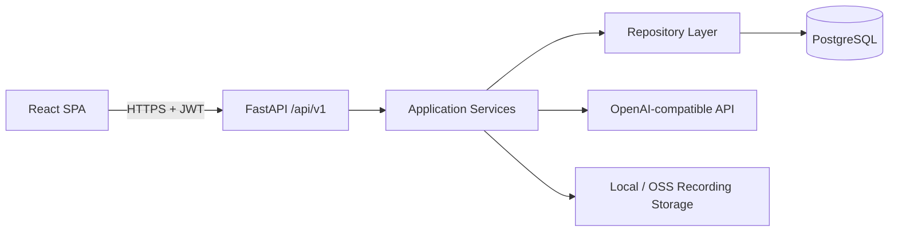
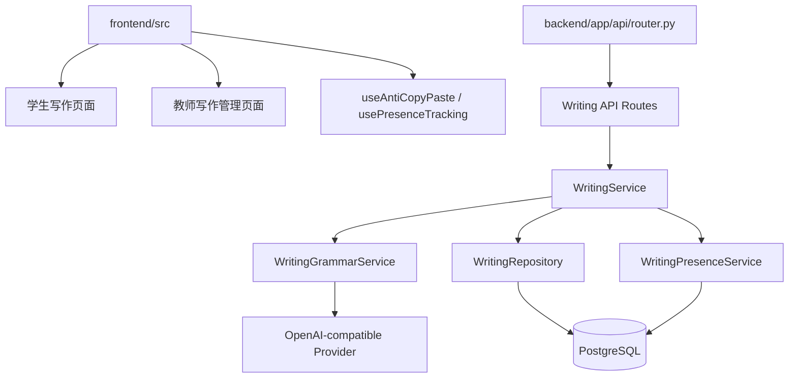

# 系统架构

## 1. System Context



现有系统已经是该分层结构。新写作模块沿用同一结构，不引入独立服务、队列或新数据库。

## 2. Component Architecture



## 3. Recommended Architecture

唯一推荐架构：**在现有单体 FastAPI + React SPA 内新增独立写作领域模块。**

原因：

- 现有系统规模不需要微服务。
- 写作作业与现有班级、用户、权限模型强相关，共享数据库是最直接的数据一致性方案。
- 语法检测只是提交流程中的一个外部服务调用，不需要独立队列。
- 页面追踪是轻量心跳 + 数据库聚合，不需要 Kafka 或 Redis。
- 现有团队和项目已经使用该分层结构，新模块保持同样风格，可维护性最高。

## 4. Layer Responsibilities

| Layer | 职责 | 输入 | 输出 |
| --- | --- | --- | --- |
| React Page | 页面状态、表单、草稿编辑、高亮展示、事件上报 | 用户操作 | API 请求 |
| FastAPI Route | 鉴权、参数绑定、错误转换 | HTTP Request | HTTP Response |
| WritingService | 作业、提交、版本、语法状态编排 | Current User + Request Schema | Response Schema |
| WritingGrammarService | 文本分段、调用 AI、校验问题范围 | 文本 | 规范化问题列表 |
| WritingPresenceService | 创建/关闭 visit、心跳超时、聚合 | submission_id, event | visit 状态 |
| WritingRepository | 数据查询和持久化 | SQLAlchemy Session + 查询条件 | ORM 对象 |
| OpenAI-compatible Provider | 只返回语法问题位置和类别 | prompt + segments | JSON issues |
| PostgreSQL | 持久化作业、提交、版本、问题、停留、违规事件 | ORM writes | ORM reads |

## 5. Data Flow

### 5.1 首次提交和语法检测

```text
Student UI
-> POST /writing/submissions/{id}/submit
-> WritingService.create_revision()
-> insert WritingRevision
-> WritingGrammarService.detect()
-> validate/normalize issues
-> insert WritingGrammarIssue
-> return WritingSessionOut
```

### 5.2 草稿自动保存

```text
Student UI
-> PATCH /writing/submissions/{id}/draft
-> WritingService.save_draft()
-> update WritingSubmission.draft_content
-> return WritingSessionOut
```

### 5.3 停留追踪

```text
Student UI
-> POST /writing/submissions/{id}/presence/enter
-> WritingPresenceService.enter()
-> close existing open visit
-> create open visit

Student UI
-> POST /writing/submissions/{id}/presence/heartbeat
-> WritingPresenceService.heartbeat()
-> update last_heartbeat_at

Student UI
-> POST /writing/submissions/{id}/presence/leave
-> WritingPresenceService.leave()
-> set ended_at and end_reason
```

### 5.4 教师查询

```text
Teacher UI
-> GET /writing/assignments/{id}/submissions
-> WritingService.list_teacher_submissions()
-> aggregate revisions, issues, visits, violations
-> return WritingTeacherSubmissionOut
```

## 6. Module Responsibilities

### Existing Modules

| Module | Change |
| --- | --- |
| `app/models/entities.py` | 增加写作模型和枚举 |
| `app/schemas/models.py` | 增加写作请求/响应 schema |
| `app/repositories/repositories.py` | 增加 `WritingRepository` 或扩展 repository |
| `app/api/router.py` | 注册写作路由 |
| `app/core/config.py` | 增加写作检测和心跳配置 |
| `frontend/src/types/index.ts` | 增加写作类型 |
| `frontend/src/routes/AppRoutes.tsx` | 增加写作页面路由 |
| `frontend/src/components/layout/AppShell.tsx` | 增加学生/教师导航 |

### New Modules

| Module | File |
| --- | --- |
| 写作领域服务 | `backend/app/services/writing.py` |
| 写作语法检测服务 | `backend/app/services/writing_grammar.py` |
| 写作页面停留服务 | `backend/app/services/writing_presence.py` |
| 学生写作页面 | `frontend/src/pages/student/WritingPage.tsx` |
| 学生写作列表 | `frontend/src/pages/student/WritingListPage.tsx` |
| 学生写作详情 | `frontend/src/pages/student/WritingTaskDetailPage.tsx` |
| 教师写作列表 | `frontend/src/pages/teacher/WritingAssignmentsPage.tsx` |
| 教师写作创建 | `frontend/src/pages/teacher/WritingAssignmentCreatePage.tsx` |
| 教师写作提交列表 | `frontend/src/pages/teacher/WritingSubmissionsPage.tsx` |
| 教师写作详情 | `frontend/src/pages/teacher/WritingReviewPage.tsx` |
| 复制粘贴拦截 Hook | `frontend/src/hooks/useAntiCopyPaste.ts` |
| 页面追踪 Hook | `frontend/src/hooks/useWritingPresence.ts` |

## 7. Why Not Alternatives

### 7.1 不扩展 `TrainingTask` / `TrainingSession`

现有口语状态机字段、录音、抽题、笔记和评价与写作完全不同。扩展会让同一张表承担两套状态机，迁移和权限判断变复杂。

### 7.2 不引入独立写作服务

当前系统是单体，写作模块只增加少量表和 API，独立服务会带来部署、认证和事务一致性成本。

### 7.3 不引入富文本编辑器

需求是纯文本写作和定位语法问题，原生 `textarea` 加旁路高亮结果已经足够，不引入 Lexical、Quill 等依赖。

