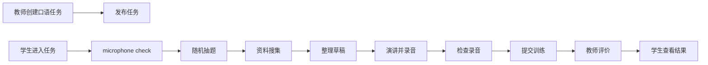
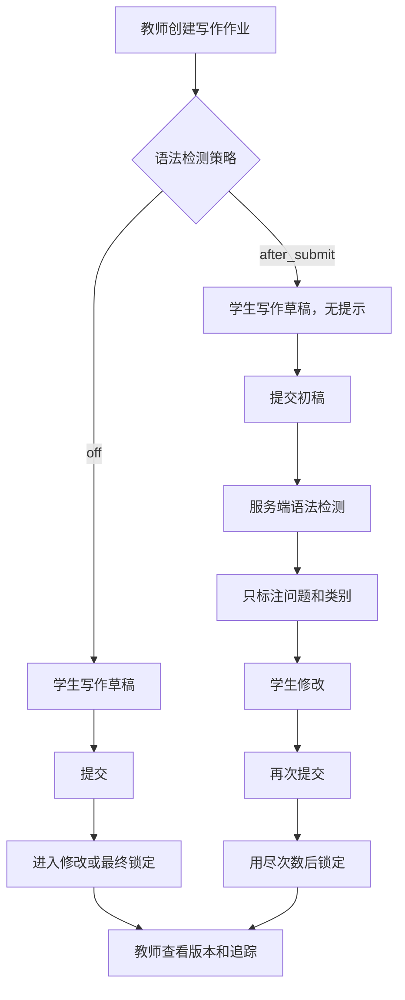
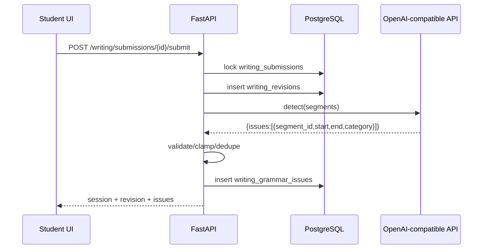
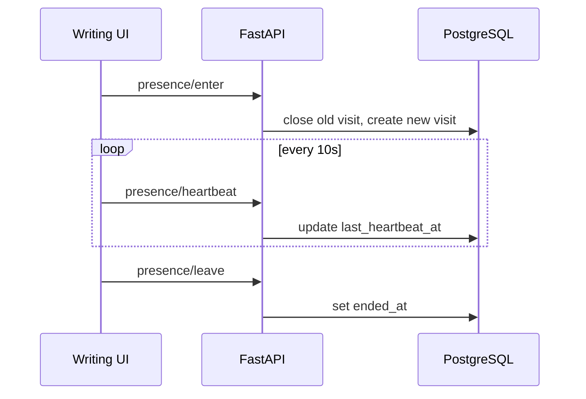
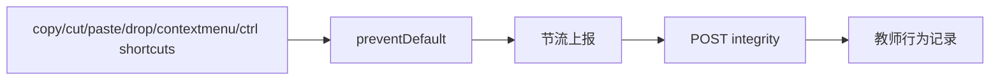

# 用户流程

## 1. 现有口语训练核心流程

```mermaid
flowchart LR
    Teacher[教师创建口语任务] --> Publish[发布任务]
    Student[学生进入任务] --> Mic[microphone check]
    Mic --> Draw[随机抽题]
    Draw --> Research[资料搜集]
    Research --> Prepare[整理草稿]
    Prepare --> Speak[演讲并录音]
    Speak --> Review[检查录音]
    Review --> Submit[提交训练]
    Submit --> Evaluate[教师评价]
    Evaluate --> History[学生查看结果]
```

## 2. 新增写作作业主流程

```mermaid
flowchart TD
    Teacher[教师创建写作作业] --> Config{语法检测策略}
    Config -->|off| Draft1[学生写作草稿]
    Config -->|after_submit| Draft2[学生写作草稿，无提示]
    Draft1 --> Submit1[提交]
    Draft2 --> Submit2[提交初稿]
    Submit1 --> Final1[进入修改或最终锁定]
    Submit2 --> Detect[服务端语法检测]
    Detect --> Mark[只标注问题和类别]
    Mark --> Revise[学生修改]
    Revise --> SubmitRev[再次提交]
    SubmitRev --> Final2[用尽次数后锁定]
    Final1 --> TeacherView[教师查看版本和追踪]
    Final2 --> TeacherView
```

## 3. 语法检测流程

```mermaid
sequenceDiagram
    participant S as Student UI
    participant API as FastAPI
    participant DB as PostgreSQL
    participant AI as OpenAI-compatible API

    S->>API: POST /writing/submissions/{id}/submit
    API->>DB: lock writing_submissions
    API->>DB: insert writing_revisions
    API->>AI: detect(segments)
    AI-->>API: {issues:[{segment_id,start,end,category}]}
    API->>API: validate/clamp/dedupe
    API->>DB: insert writing_grammar_issues
    API-->>S: session + revision + issues
```

## 4. 页面停留/离开追踪

```mermaid
sequenceDiagram
    participant UI as Writing UI
    participant API as FastAPI
    participant DB as PostgreSQL

    UI->>API: presence/enter
    API->>DB: close old visit, create new visit
    loop every 10s
        UI->>API: presence/heartbeat
        API->>DB: update last_heartbeat_at
    end
    UI->>API: presence/leave
    API->>DB: set ended_at
```

## 5. 复制粘贴拦截

```mermaid
flowchart LR
    Event[copy/cut/paste/drop/contextmenu/ctrl shortcuts] --> Block[preventDefault]
    Block --> Throttle[节流上报]
    Throttle --> API[POST integrity]
    API --> Teacher[教师行为记录]
```

